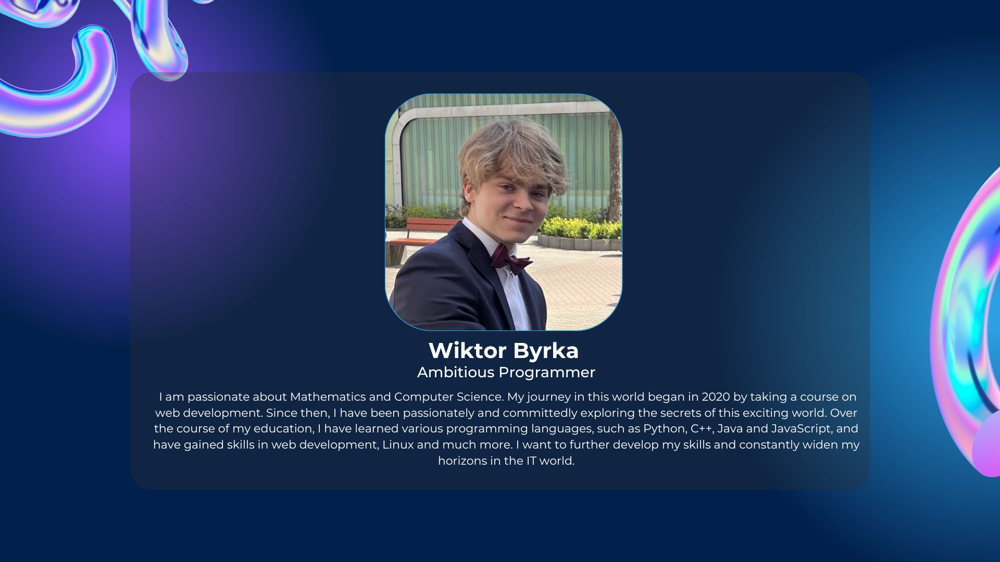

<h2 align="center">About Me</h2>
 
| Label | Info |
| ------------- | ------------- |
| Name | Wiktor Byrka @WiktorB2004|
| Languages | Polish - native, English - B2 |
| Programming languages | Python, C, C++, JavaScript, TypeScript, Rust, Haskell |
| Skills | Linux, Microsoft VBA, Scrum, Math, OOP, TDD, DS & Algorithms |
| Contact | <ul><li> byrka.w@gmail.com </li><li> [PL] +48 695 436 427</li></ul> |
| Links | <ul><li>[Website](https://wiktority.pl)</li><li>[LinkedIn](https://www.linkedin.com/in/wiktor-byrka-b30576204/)</li><li>[LeetCode](https://leetcode.com/WiktorB2004/)</li></ul> |

<h2 align="center">Portfolio</h2>

| Topic | Projects |
| ------------- | ------------- |
| Python | <ul><li>UNDER DEVELOPMENT - more advanced projects</li><li>[Pong Game](https://github.com/WiktorB2004/Pong-Python_pygame) - Pong game using pygame module</li><li>[Pomodoro timer + Todo](https://github.com/WiktorB2004/Pomodoro_timer-Python_tkinter) - timer + todo list using tkinter module</li><li>[Space Invaders](https://github.com/WiktorB2004/Space_invaders-Python_pygame) - Space Invaders game using pygame module</li></ul> |
| C++ | <ul><li>[RPNCalculator](https://github.com/WiktorB2004/RPN_Calculator-Cpp) - RPN Calculator in C++</li><li>[Login/Register app](https://github.com/WiktorB2004/Login-Registration-Cpp) - first C++ practice project</li></ul> |
| C | <ul><li>[Language Interpreter (WLang)](https://github.com/WiktorB2004/Language_Interpreter-C) - My own simple language interpreter in C</li></ul> |
| JavaScript / TS | <ul><li>[JSON Transformer](https://github.com/WiktorB2004/JSON_Transformer-JS) - Easy project to get experience with NestJS</li></ul> |
| Haskell | <ul><li>[Calculator](https://github.com/WiktorB2004/Calculator-Haskell) - conversion to RPN and solving + linear/quadratic equations</li><li>[Truth table generator](https://github.com/WiktorB2004/Truth_table_generator-Haskell) - truth table generator for any logic formula (using another repo code)</li><li>[TicTacToe](https://github.com/WiktorB2004/TicTacToe-Haskell) - TicTacToe game using tutorial</li></ul> |
| Rust | <ul><li>[File Encryption/Decryption](https://github.com/WiktorB2004/File_Protection-Rust) - file explorer + encryption/decryption </li><li>[Todo](https://github.com/WiktorB2004/Terminal-Todo-Rust) - Terminal TODO, using tutorial </li></ul> |
| Arduino | <ul><li>[Arduino](https://github.com/WiktorB2004/Arduino) - All the arduino projects</li></ul> |
